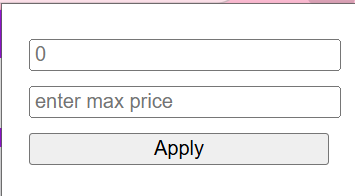

# wb_extension
Это расширение для Chrome позволяет фильтровать товары на сайте Wildberries.ru по заданному диапазону цен. Товары в пределах указанного диапазона выделяются зелёной рамкой, а товары вне диапазона затемняются, что упрощает поиск подходящих предложений. Расширение также обрабатывает динамически загружаемый контент, применяя фильтр к новым товарам при прокрутке страницы.

## Установка

1. Склонируйте или скачайте этот репозиторий на свой компьютер.
2. Откройте Google Chrome и перейдите на страницу `chrome://extensions/`.
3. Включите **Режим разработчика** в правом верхнем углу.
4. Нажмите **Загрузить распакованное расширение** и выберите папку с файлами этого проекта.
5. Расширение появится в списке установленных.

## Использование

1. Перейдите на сайт [Wildberries.ru](https://www.wildberries.ru/).
2. Нажмите на иконку расширения в панели инструментов Chrome, чтобы открыть всплывающее окно.
3. Введите минимальную и/или максимальную цену в соответствующие поля.
4. Нажмите **Применить**, чтобы отфильтровать товары:
   - Товары в указанном диапазоне цен будут выделены зелёной рамкой.
   - Товары вне диапазона будут затемнены (с пониженной прозрачностью).
5. При прокрутке страницы фильтр автоматически применяется к новым загруженным товарам.

## Скриншоты

  
  

## Известные ограничения

- Расширение работает только на сайте Wildberries.ru и может некорректно функционировать на других сайтах.
- При загрузке нового контента может наблюдаться небольшая задержка в применении фильтра.

## Как внести вклад

Приветствуются любые улучшения! Если вы нашли ошибку или хотите предложить новую функцию, откройте issue. Чтобы внести изменения в код:

1. Сделайте форк этого репозитория.
2. Создайте новую ветку для ваших изменений.
3. Отправьте pull request с описанием ваших доработок.

## Контакты

По вопросам или для поддержки открывайте issue на GitHub.